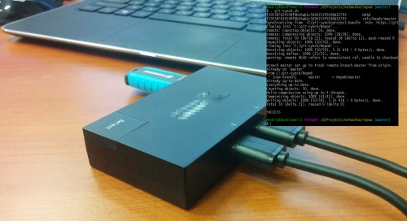

git-bundle-synch
=======
A bash script to synchronize two disconnected repositories via bundle file on a media.

Usage
---------
* Copy and edit git-bundle-synch.sh
* Run from git bash '. git-bundle-synch.sh'

What does it do
---------
* Tries to connect to both repositories to identify which one is accessible
* Fetches sources from available repository
* Fetches sources from bundle file on USB-stick (git bundle file is like a zip file with history and all files)
* Tries to merge these two folders with flag –allow-unrelated-histories so that history is completely preserved
* If merge succeeds it pushes changes to available repository and recreates bundle
* If merge fails, you would need to manually resolve conflicts and push

Read more [here](http://andriybuday.com/2016/11/synch-two-git-repositories-using-bundle-and-usb-stick.html).

Copyright and license
---------------------
The license is available within the repository in the [LICENSE](./LICENSE.md) file.
